## PowerDev系列（一）在Azure Function中，处理Power Apps中的业务逻辑

借这个地方，记录闲暇时间做的一些小实验，也是博客重新开张，会尝试当前流行的低代码与云平台结合中，一些技术上的PoC. 重新开张, 但人懒了, 文章里并不是 `Step by Step` 的实现, 而是提供了当时实验的大体思路以及相关源码, 以及最后实现的效果, 供大家参考!

今天这个话题，想跟大家聊的是，在 `Power Apps` 的应用开发中, 或 `Power Automate` 的流程开发中, 经常会遇到, 一些业务逻辑, 例如数据的处理, 功能的调用, 在 `Power Platform` 中无法实现, 或实现起来有困难, 要么嵌套特别复杂、公式调用麻烦, 要么好不容易实现了, 但性能堪忧. 在有些情况下, 当我们发现 `Power Platform` 做不了或不知道怎么做的时候, 可以想想 `Azure Function`, 也许你要实现的那些功能, 在 `Azure Function` 中实现起来还挺容易的, `Python` 小代码一写, 问题就完美解决了.

今天瞎想了一个场景

```
小李是财务部的, 正在利用 Power Apps 开发一个报销的应用, 大部分功能都做完了, 有一个地方不知道该咋实现, 就是汇率的换算, 平台也没有提供公式, 也没有提供组件; 小李就去问IT部门的张三说咋办, 张三说等我俩小时, 我帮你造一个, 回头造好了, 你就当他是个咱们公司自己开发的公式, 别的公式咋用的, 他也咋用.
```

整个场景的逻辑架构如图所示

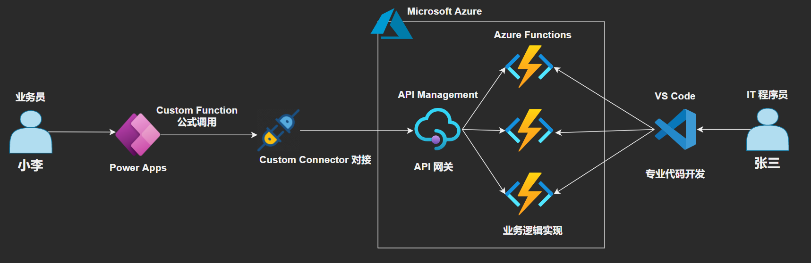

这个场景的实现，就分了下面的几步

### 第一步 在 Azure Function 中, 开发两个函数

这里主要实现的就是完成你的业务逻辑. 在示例中, 张三写了两个函数, 分别用来处理 1) 获取当前所有的可用汇率英文缩写; 2) 指定要查询的汇率, 例如美元vs人民币, 获取当前最新汇率值. 整个示例还是非常简单的.

想要尝试的小伙伴, 可以利用 [快速入门：在 Azure 中使用 Visual Studio Code 创建 Python 函数](https://docs.microsoft.com/zh-cn/azure/azure-functions/create-first-function-vs-code-python) 来构建 Azure Function.

本次实验

- 采用的是 `Azure App Service Plan S1` 来构建 `Azure Function` 函数
- 一个 `Function App` 包含了两个 `Functions`
- OS 为 `Linux`
- 开发语言为 `Python 3.8`
- Trigger 为 `HTTP`

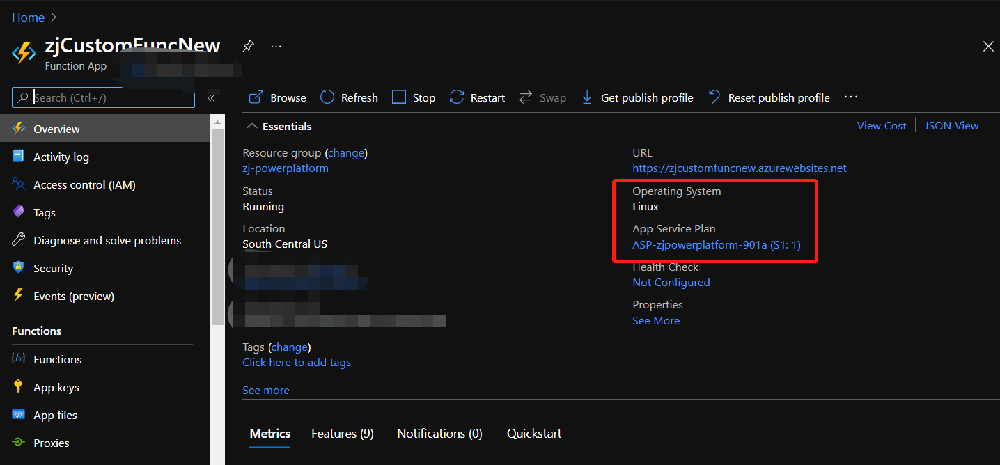
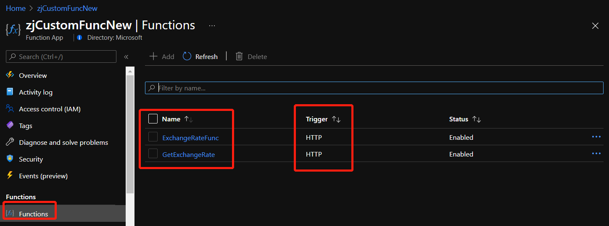

第一个函数为 `ExchangeRateFunc`, 实现的功能是获取当前所有支持的汇率英文缩写, 源代码 [ExchangeRateFunc.py](./files/20210404/ExchangeRateFunc.py), 源码截图及`Azure Function`调用测试结果如下

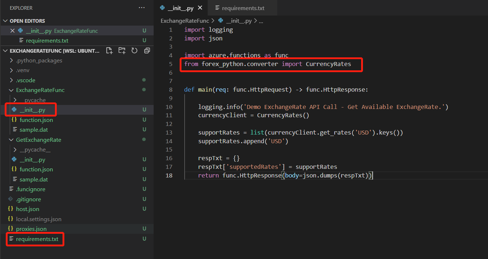
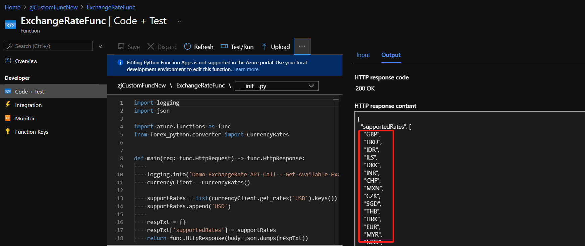

第二个函数为 `GetExchangeRate`, 实现的功能是指定相关的两个英文字母缩写, 例如 `USD` & `CNY`, 获取其当前汇率, 源代码 [GetExchangeRate.py](./files/20210404/GetExchangeRate.py), 源码截图及`Azure Function`调用测试结果如下

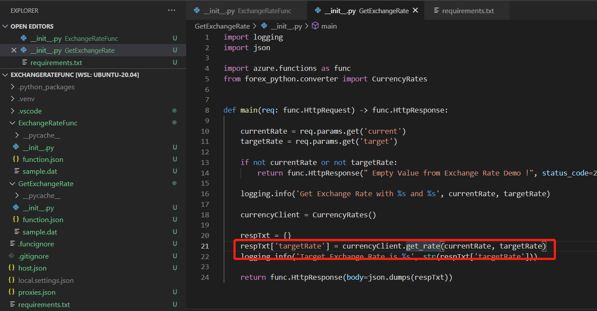
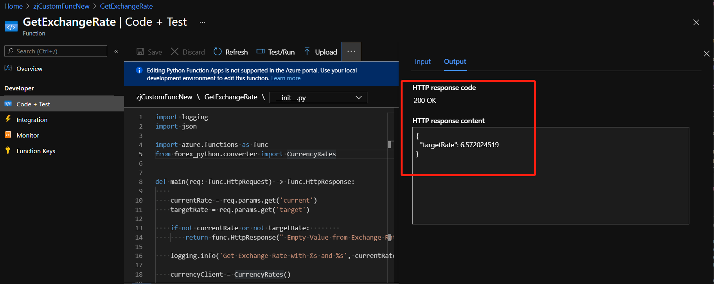

值得注意的是, 两个函数均调用了额外的Python包, 需要在Function App的`requirements.txt`中描述, 发布时云端会自动安装, 描述如图所示, 源代码 [requirements.txt](./files/20210404/requirements.txt)

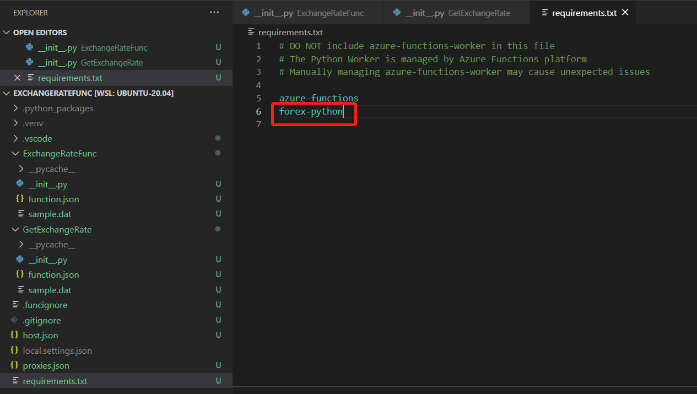

引用的包是调用了一个开源的调用欧洲银行API获取汇率的开源项目, 更多描述可参照 [forex-python 1.5](https://pypi.org/project/forex-python/)

至此, 万里长征第一步完成.

### 第二步 创建 API Management, 并将 Azure Function 作为API, 加入 API Management

在这里添加一个 `API Management`, 主要用来充当 API 网关的作用, 对发布的 API 调用进行统一的管理. 我们可以看到, 示例中, 要处理汇率计算的功能, 需要两个API, 在实际项目中, 可能一些复杂的逻辑需要更多的API函数, 整个管理工作还是比较复杂的. API 网关的加入, 主要起到了以下两点的作用

- 统一管理, 在创建 `Custom Connector` 时, 只需创建一个 `Custom Connector` 及一系列函数公式, 提供了统一使用的接口
- 集中管理, 主要管理用户调用的身份认证与权限控制, 无需在每一个函数的代码层面添加用户权限管理的代码, 将这部分功能集中在 `API Management` 中, 省时省力

本次实验创建的 API Management 为开发版, API Management 对接 Azure Function, 可参照 [在 Azure API 管理中将 Azure Function App 作为 API 导入](https://docs.microsoft.com/zh-cn/azure/api-management/import-function-app-as-api), 添加完成后, 如图所示

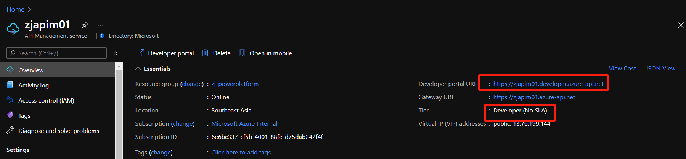
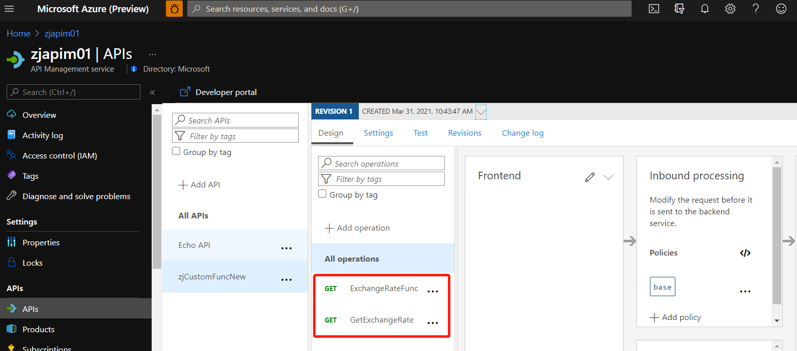

测试没有什么问题, 就可以将这两个功能发布出去, 对外可用.

### 第三步 创建 Custom Connector, 及使用它的 Connection

当汇率计算的功能全部实现好后, 下一步就是怎么样让小张能用到自己的应用里面. 这个时候就会利用到 `Custom Connector`. `Custom Connector` 能够将绝大部分外部的、基于API方式调用的服务, 转换成自定义公式, 供业务人员使用.

针对本次示例, 我创建了一个Custom Connector, 整个Connector的源文件可参照 [CustomFuncs.swagger.json](./files/20210404/CustomFuncs.swagger.json), Swagger源码截图如下:

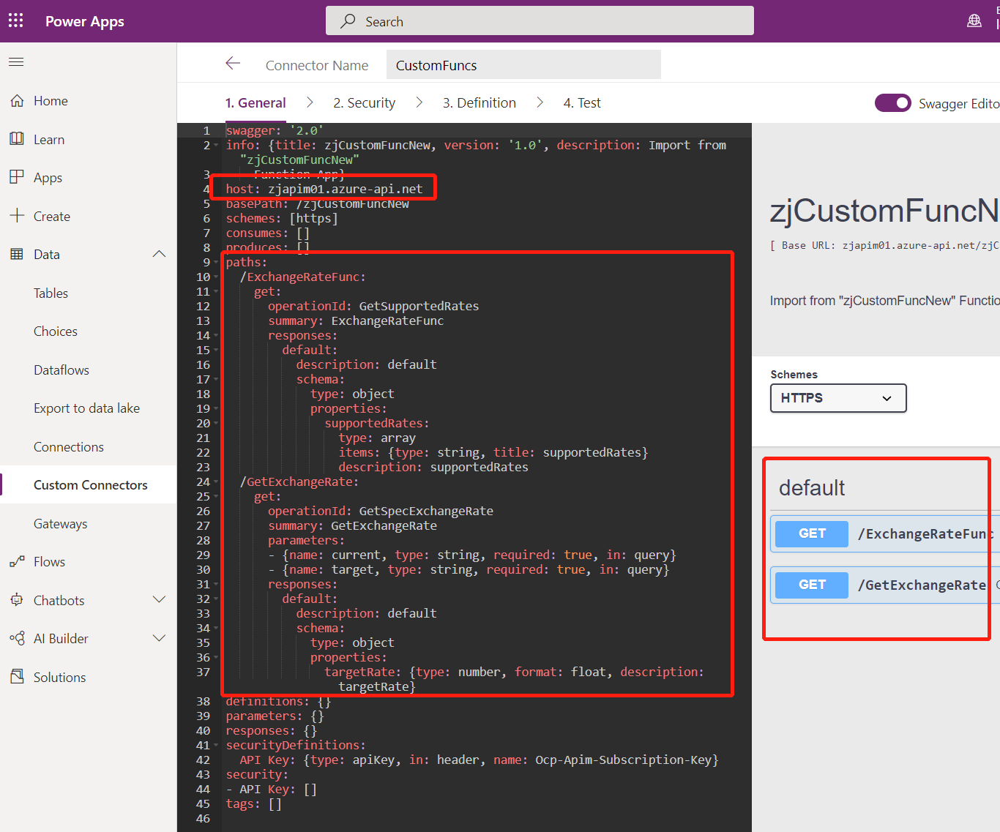

### 第四步 在 Power Apps 中使用

最后一步就是如何在 Power Apps 中来使用开发好的自定义函数. 其实就跟使用系统自带的公式并没有什么差别.

首先, 需要对这个Connector创建一个Connection

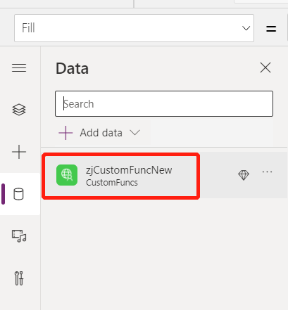

然后, 在页面中你就可以来用这个Connector里面针对汇率计算的两个函数了.

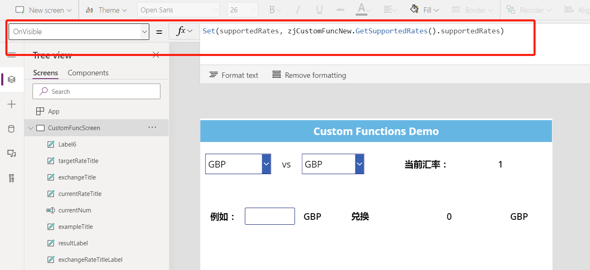
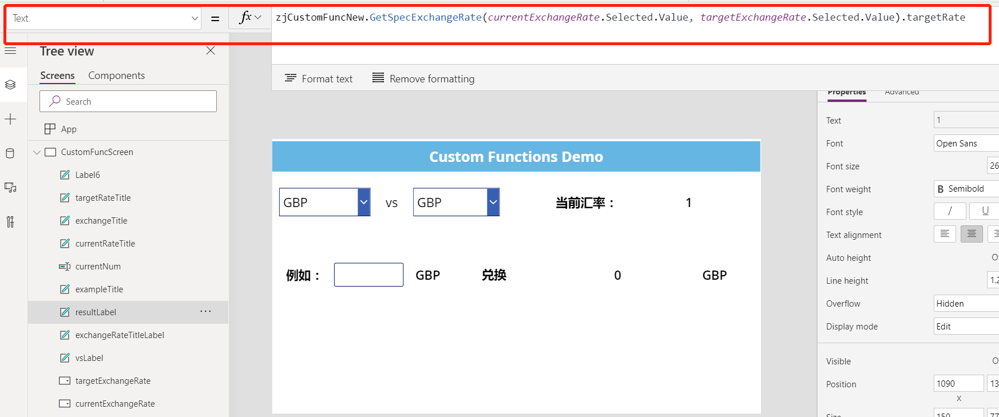

最后, 一个针对汇率计算的Demo页面如图所示

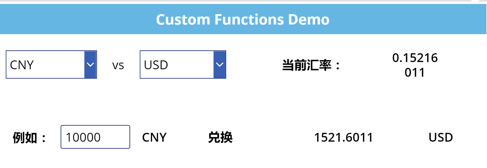