## 在 Canvas App 中实现离线读取PDF功能

在这个时代的人，离不开互联网，甚至吃饭、睡觉，也会用到手机、手环. 但现实情况下，难免在有些环境中，网络质量不好或完全就是脱网的状态，那这种情况下，如何继续有限制的使用手机上的APP呢？今天这个实验，就跟大家介绍一下，在脱机的情况下，如何有限制的使用 Canvas App 开发出来的应用，来查看PDF文件.

Power Apps 在提供应用开发的同时，考虑到了脱机的场景，所以提供了相对应的脱机模式. 在官方文档中，提供了详细的文档指导及示例 Demo，来帮助大家快速上手实践，详细文档请参考 [开发可脱机运行的画布应用](https://docs.microsoft.com/zh-cn/powerapps/maker/canvas-apps/offline-apps)

提取一下上文的重点，在画布应用的开发过程中

- 利用 `Collections` 存储需要脱机处理的数据变量
- 利用 `LoadData` & `SaveData` 实现脱机数据的保存及加载
- 利用 `Connection` 变量判断当前应用的状态

脱机应用的开发，是存在一定的限制，虽然当下，智能手机已经是标配，很少再看到古董机，但每个智能手机中的内存大小还是不太一样的，脱机保存的数据都存储在了Power Apps的缓存中，在启动App时，加载到内存，所以在设计时，需要把这点考虑进去.

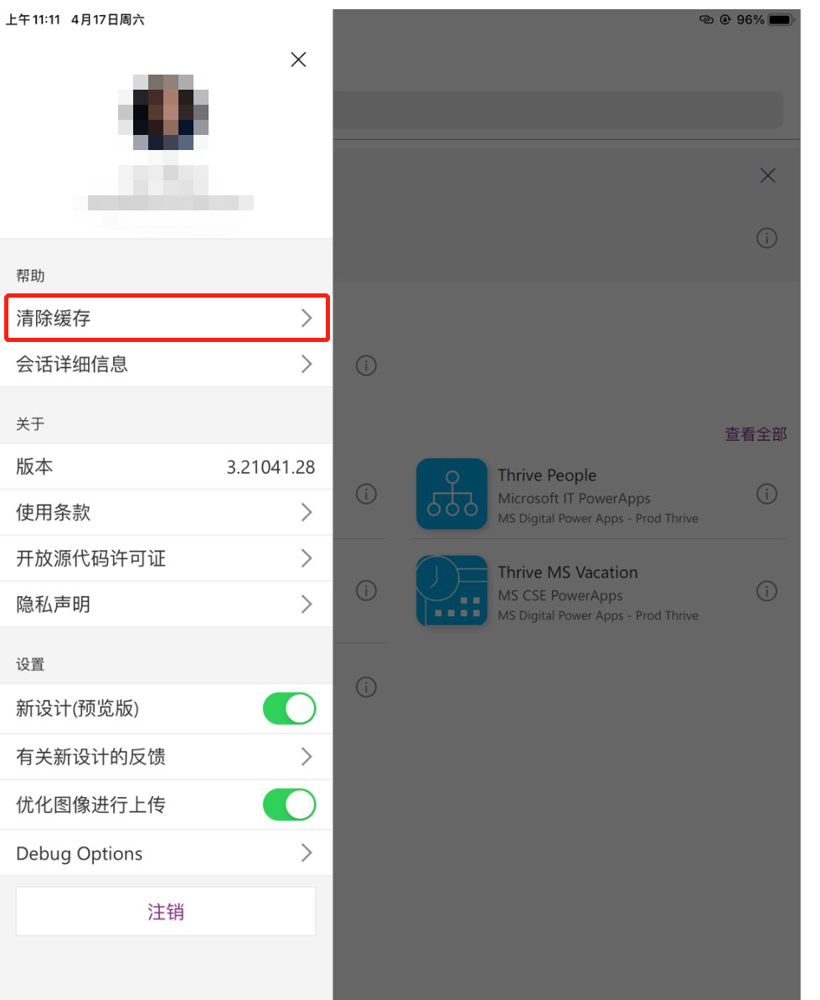

当你在移动端设备打开 Power Apps时，找到左侧菜单栏，会有清理缓存的选项，这里面的数据，就是离线缓存的数据.

这次实验非常简单，主要是利用 Canvas App 实现离线读取PDF的功能，实验效果如下图

当平板设备处于有网的情况下，连接状态显示为 `Connected`，点击 `Add Data`，就会将PDF数据保存在变量中，点击 `Save Data` 就会保存在 Power Apps 的缓存中，左右两块屏幕均显示PDF内容

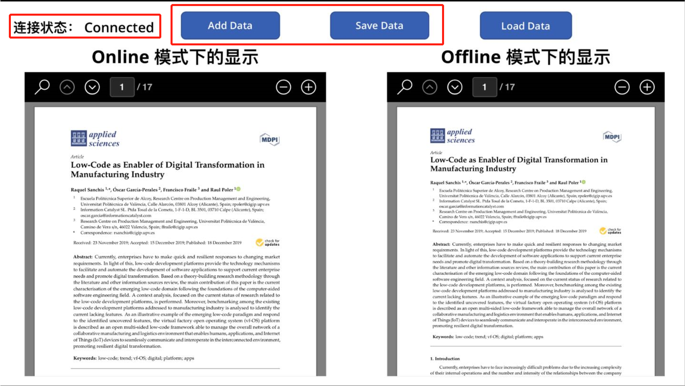

当平板设备处于没网的情况下，连接状态显示为 `Disconnected`，点击 `Load Data`，只有右侧的屏幕显示PDF内容

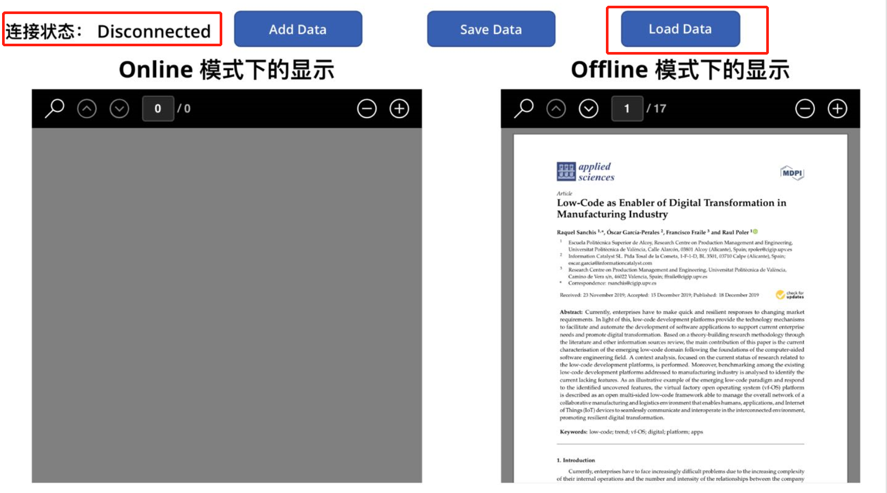

### 第一步 获取 PDF 数据

这里，我用了一个 `Power Automate` 的流，从Sharepoint中获取PDF数据，并返回给PowerApps，从Power Apps中触发. 但这不是一个唯一的选项，这个地方为了模拟另外一个需求，才额外添加了一个自动化流程进行后台处理获取数据（但具体啥需求我现在给忘了），获取数据的方式有很多，大家在真实的场景中可以根据需要进行.

整个自动化流程就三部

- 添加触发器，从Power Apps中触发
- 连接 Sharepoint，获取 Sharepoint 中的 PDF 文件
- 将 PDF 文件内容返回给 触发的 Power Apps

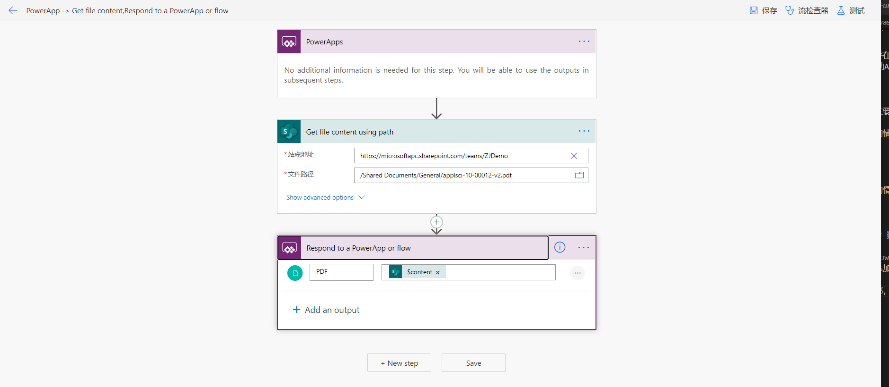

### 第二步 创建一个平板布局的APP，并添加所需功能

首先添加的是，在应用打开加载页面时，触发 `Power Automate`，获取PDF数据. 修改页面的属性 `OnVisible`，对应函数如下 `UpdateContext({pdf_v: 'PowerApp->Getfilecontent,RespondtoaPowerApporflow'.Run()});`

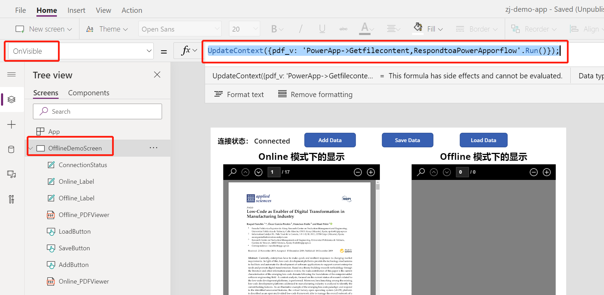

这样，PDF加载进来的数据就保存在页面变量 `pdf_v` 中.

接着，添加连接状态的 `Label`, `Text` 所对应的公式如下 `"连接状态： " & If(Connection.Connected, "Connected", "Disconnected")`

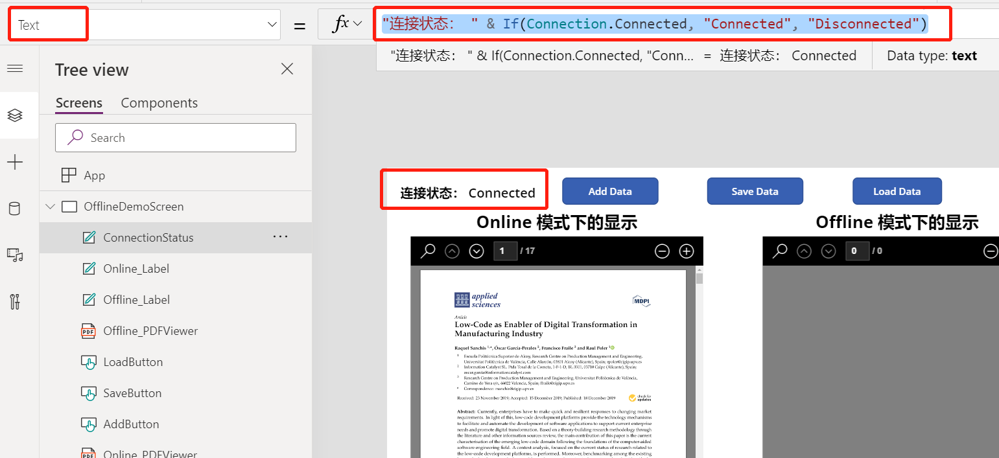

添加 `Add Data` 按钮，将PDF数据存储在 Collection 中

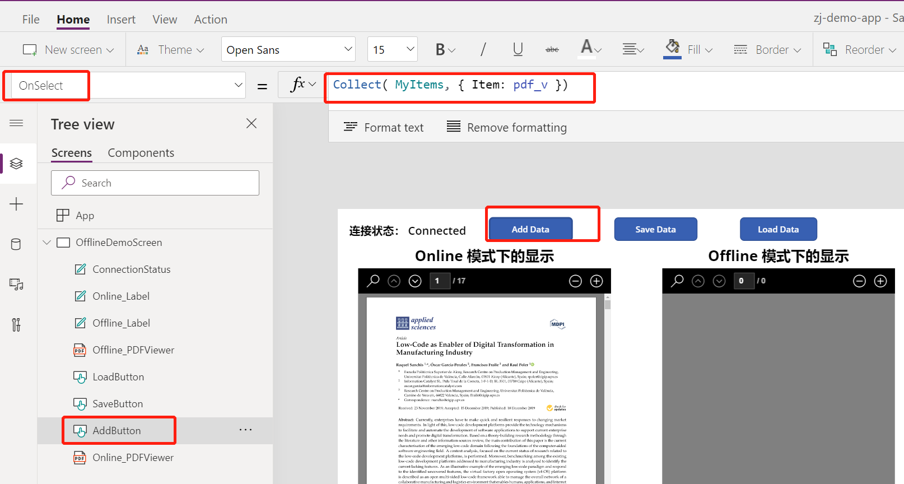

添加 `Save Data` 按钮，将 Collection 中的数据缓存到 Power Apps中

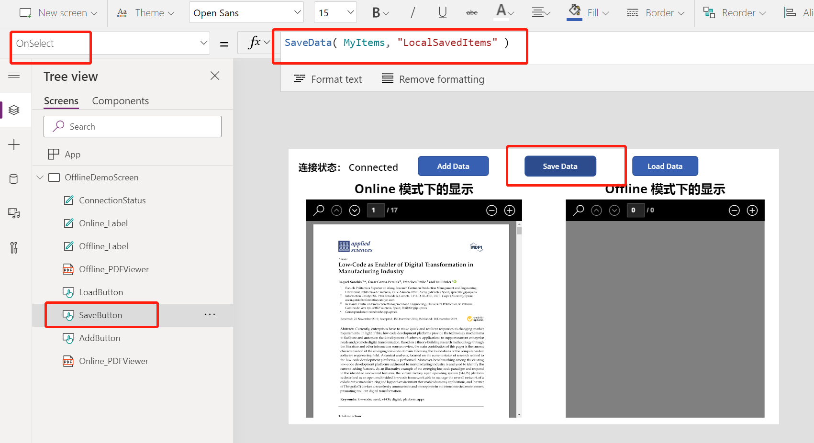

添加 `Load Data` 按钮，从缓存中加载数据到 Collection `MyItems` 中

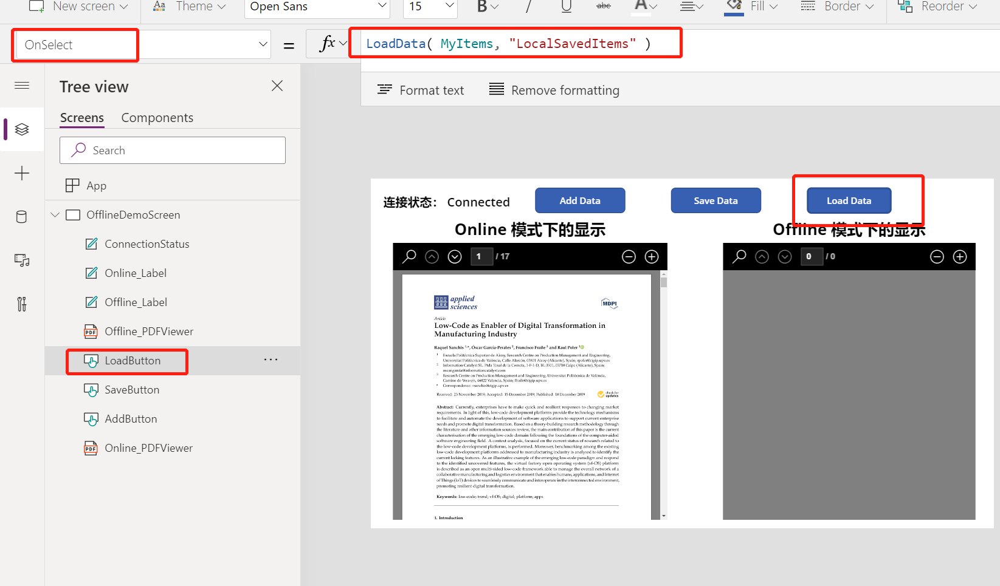

最后添加两个 `PDF Viewer` 控件, Online部分的控件中，属性 `Document` 的数据来源于加载进来的PDF, `pdf_v.pdf`; Offline部分的控件中，属性 `Document` 的数据来源时从缓存中加载进来，即读取 Collection `MyItems` 内容.

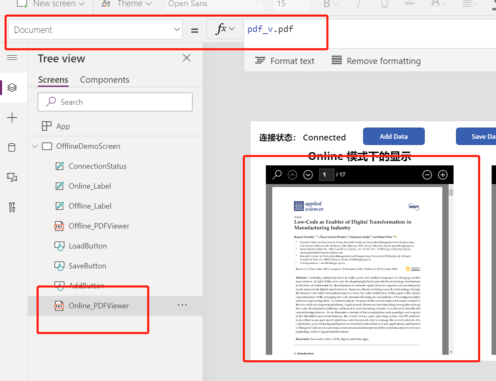

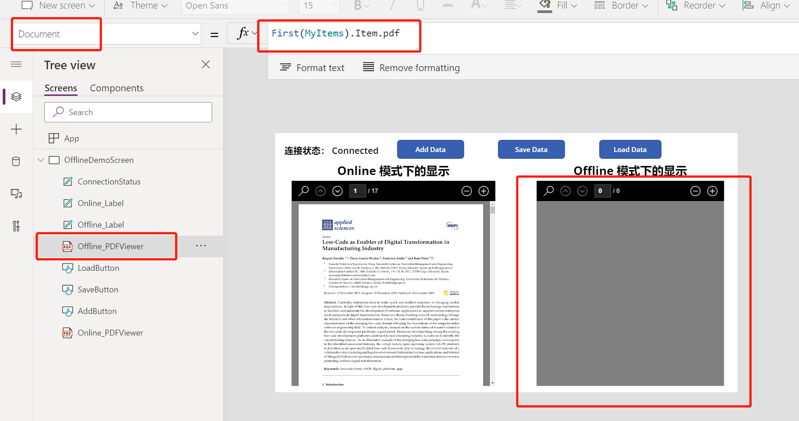

哈哈这样就搞定了！兮爷也学完舞蹈了，准备去吃饭了 ！